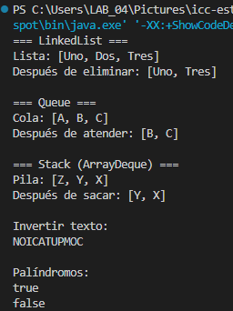
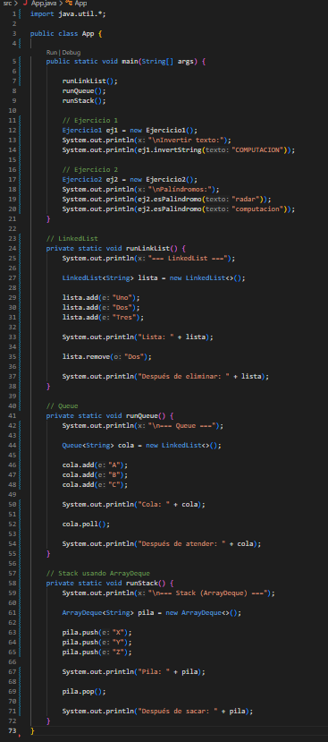
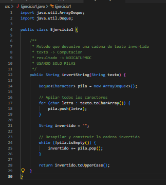
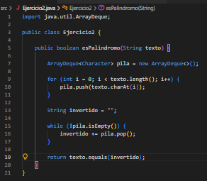

# Universidad Politécnica Salesiana

## Estructuras de Datos en Java

**Nombre:** Daniel Flores

Este proyecto contiene ejemplos prácticos del uso de estructuras de datos en Java, incluyendo listas enlazadas, colas, pilas e implementación de algoritmos básicos utilizando dichas estructuras.

---

## Contenido

### 1. LinkedList

Se realizan operaciones básicas sobre una lista enlazada utilizando la clase `LinkedList`, como inserción, consulta de elementos y eliminación.

### 2. Queue (Cola)

Se implementa una cola utilizando la interfaz `Queue` para simular la atención de elementos siguiendo el principio FIFO (*First In, First Out*).

### 3. Stack (Pila)

Se utilizan pilas mediante `ArrayDeque`, aplicando operaciones de inserción y eliminación bajo el principio LIFO (*Last In, First Out*).

### 4. Inversión de cadenas utilizando pilas

Se desarrolla un método que invierte una cadena de texto utilizando únicamente una estructura de tipo pila.

**Ejemplo:**

```text
Entrada:  COMPUTACION  
Salida:   NOICATUPMOC
```

---

### 5. Verificación de palíndromos usando pilas

Se implementa un método que permite verificar si una palabra es palíndroma utilizando únicamente una pila.

Una palabra es palíndroma si se lee igual de izquierda a derecha y de derecha a izquierda.

**Ejemplos:**

```text
Entrada:  radar  
Salida:   true

Entrada:  computacion  
Salida:   false
```

---

## Estructura del Proyecto

* `src`: contiene el código fuente del proyecto.
* `bin`: contiene los archivos compilados.
* `lib`: contiene dependencias externas (si son necesarias).

---

## Objetivo

Comprender el funcionamiento de las principales estructuras de datos lineales en Java y aplicar sus operaciones fundamentales mediante ejercicios prácticos.

---

## Evidencia

### Salida en consola



### Código de implementación




---

## Método implementado (Ejercicio 2)

```java
public boolean esPalindromo(String texto) {

    ArrayDeque<Character> pila = new ArrayDeque<>();

    for (int i = 0; i < texto.length(); i++) {
        pila.push(texto.charAt(i));
    }

    String invertido = "";

    while (!pila.isEmpty()) {
        invertido += pila.pop();
    }

    return texto.equals(invertido);
}
```

---

## Conclusión

En esta práctica se logró comprender el uso de estructuras dinámicas lineales como listas, colas y pilas en Java. Además, se aplicaron estos conceptos en la resolución de problemas como la inversión de cadenas y la verificación de palíndromos, utilizando pilas como estructura principal.
